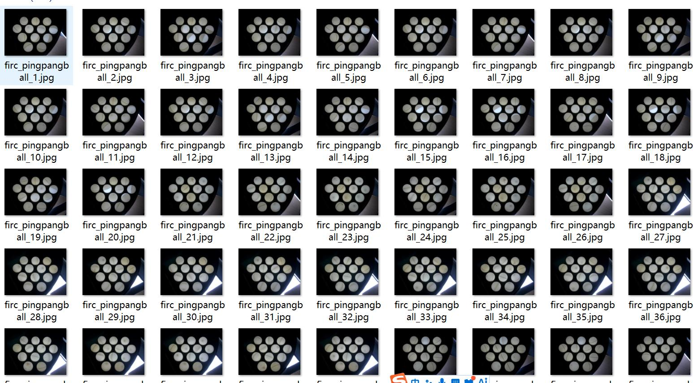
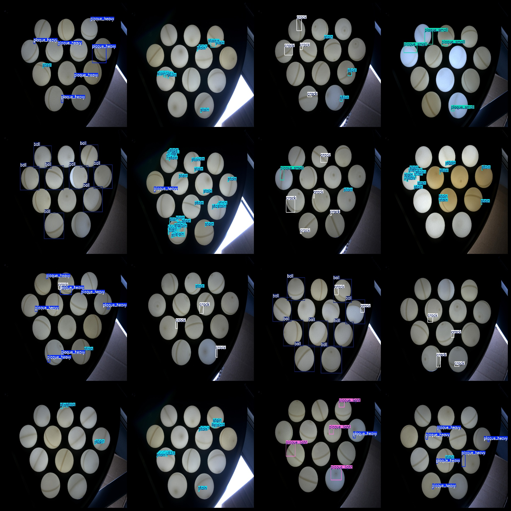
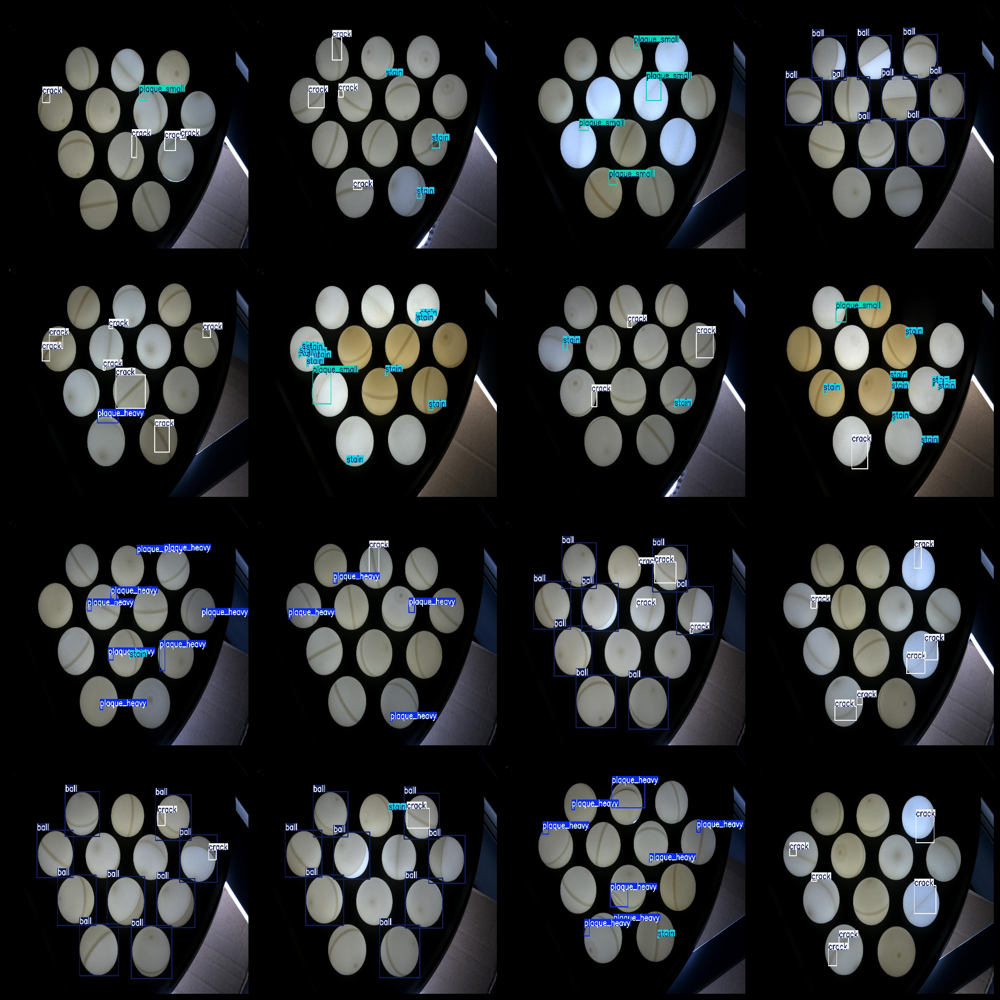

# Twinfish Ping Pong Table Tennis Defect Detection Dataset with VOC+YOLO format and 181 images in 6 categories

Dataset format: Pascal VOC format + YOLO format (txt files without split paths, only containing jpeg images and corresponding VOC format xml files and yolo format txt files)
Number of images (jpg file count): 181
Number of annotations (xml file count): 181
Number of annotations (txt file count): 181
Number of categories: 6
Annotation category names (note that the order of categories in yolo format is not consistent with this, but is based on the classes.txt in the labels folder): ["ball", "crack", "plaque_heavy", "plaque_light", "plaque_small", "stain"]
Each category of annotations:
- Ball (to prevent false detection, only labeled a small part) number of boxes = 275, occupied by images = 42
- Crack (cracks) number of boxes = 413, occupied by images = 105
- Plaque_heavy (heavy plaques) number of boxes = 148, occupied by images = 47
- Plaque_light (light plaques) number of boxes = 74, occupied by images = 21
- Plaque_small (small plaques) number of boxes = 103, occupied by images = 34
- Stain (stains) number of boxes = 659, occupied by images = 92
Total number of boxes: 1672
Image resolution: 4024x3036
Using the labeling tool: labelImg.
Labeling rules: Draw a rectangle around the category.
Important note: The dataset does not have splits for training, validation, and test sets; you need to divide them yourself.
Special notice: This dataset does not guarantee the accuracy of the trained model or weight files.
Image preview:
## Image

Here is a pay link on Stripe ( https://buy.stripe.com/3cs8yP7sY87d0vu9AB ). Please contact me lonlonago@foxmail.com after funding $89, and I will send you a complete data files , thank you!

